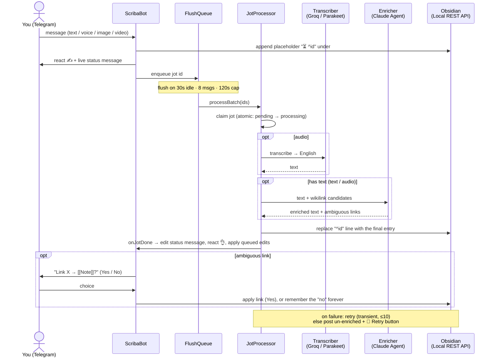
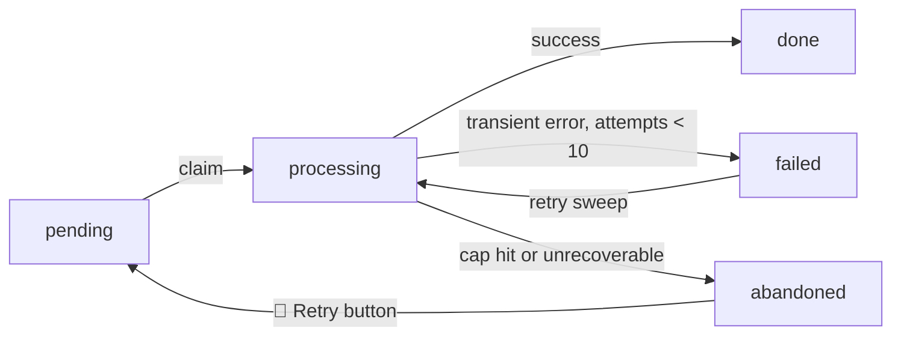

# scriba

Journal to Obsidian from Telegram. Send a text or voice note and scriba writes it into
today's daily note, just because I am too lazy

> **This is a personal bot.** I built it for myself. It makes a lot of assumptions about how my vault and machines set up, so it probably won't work for you out of the box. It's public because the code might be useful. Read the assumptions before you try to run it.

## What it assumes

- **One user.**, it will only respond to one Telegram user id, and it will only
write to one Obsidian vault.
- **You run Obsidian with the Local REST API plugin**, reachable from wherever scriba runs.
- **Your vault looks like mine.** Daily notes under `notes/daily notes`, a `## Journal` heading to write under, a `## Habits` checklist, a daily-note template, an assets folder. All configurable (see [Environment](#environment)), but the defaults match my vault. 
- **The vault is in English.** Anything you send in another language is translated on the way in.
- **You have a Claude subscription** (an OAuth token, not an API key). Enrichment runs on it and falls back to a free Groq model when the subscription runs out.
- **It runs as one always-on process.** Long polling, because it's simpler

## What it does

- Writes a placeholder the instant a message arrives, then fills it in place. 
- Transcribes voice locally with Parakeet (default) or remotely with Groq.
- Adds contextual `[[wikilinks]]`. Ambiguous ones you confirm with a button
- Edit a jot by replying to it: `s/old/new/`, `replace X with Y`, freeform, or `/delete`.
- Retries failed jots up to 10 times. If it gives up, it posts the jot un-enriched with a retry button.
- It assumes you have some sort of habit checklist in your daily note. It can
review it with you one habit at a time. And it also assumes you have a rating
system for your days, which it can prompt you for nightly.

## Setup

You need Node 24, an always-on host with Docker, Obsidian running the Local REST API plugin,
a Telegram bot, and a Claude subscription.

1. **Make a Telegram bot.** Talk to [@BotFather](https://t.me/BotFather), create one, copy the token.
2. **Find your Telegram user id.** Message [@userinfobot](https://t.me/userinfobot) or another raw message bot to get the allowed ID
3. **Get a Claude token.** Run `claude setup-token` and copy the result. 
4. **Turn on the Obsidian Local REST API** plugin and copy its key. Note the URL it serves on (default `https://127.0.0.1:27124`). 
5. **Configure.** `cp .env.example .env` and fill it in. At minimum set the four required variables; see [Environment](#environment) for the rest.
6. **Run it.** `docker compose up -d` starts scriba and the transcription sidecar. 
7. **Say hi.** Message your bot. It should write to today's note. If nothing shows up, check `docker compose logs -f scriba`.

Prefer Groq over the local sidecar? Set `TRANSCRIBER=remote`, add `GROQ_API_KEY`, and run just `docker compose up -d scriba`.

## Commands

Scriba has a set of commands that will be shown in the bot's menu, you can type
`/menu` and it will be a completely interactive experience. You can also type `/help` to see it directly as a list.

## Flowchart of how things work

A jot (a single journal entry) is written to the note **twice**. 

First, an instant placeholder that fixes its order, then the enriched version in place. Enrichment happens after a batch flush so we can group the API calls to LLMs because they're expensive.

> Enrichment means that it will transcribe the audio if it's an audio, add the image or video as attachment, will try to find other notes that match the text and add `[[wikilinks]]` to them, and will also try to find ambiguous links and ask you to confirm them. It's optional, and if it fails, it will retry a few times before giving up and posting the jot un-enriched with a retry button.



Status machine:



## Environment

Every variable lives in [`.env.example`](./.env.example), each with a comment explaining it. Four are required (`TELEGRAM_BOT_TOKEN`, `ALLOWED_TELEGRAM_USER_ID`, `CLAUDE_CODE_OAUTH_TOKEN`, `OBSIDIAN_API_KEY`); the rest have working defaults.

## Develop

Run it without Docker:

```sh
npm install     # Node 24, builds the better-sqlite3 addon
cp .env.example .env
npm run migrate # apply schema
npm run dev     # watch mode
npm test        # core logic
```

## License

Elastic License 2.0. See [LICENSE](./LICENSE).
