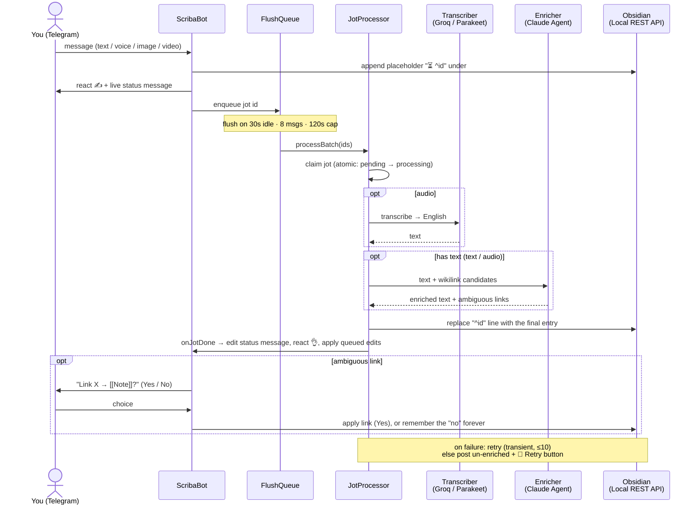
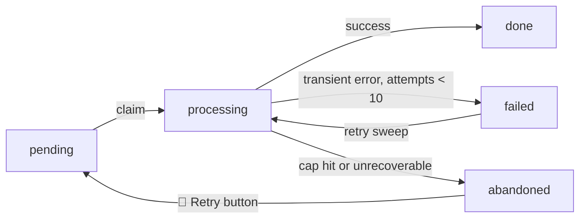

# scriba

Journal to Obsidian from Telegram. Send a text or voice note and scriba writes it into
today's daily note, cleaned up and linked. Images and videos are saved and embedded.

> **This is a personal bot.** I built it for myself and run it on my own homelab. It makes a
> lot of assumptions about how my vault and machines are wired, so it probably won't work for
> you out of the box. It's public because the code might be useful, not because it's a
> product. Read the assumptions before you try to run it.

## What it assumes

- **One user.** A single Telegram user id is allowed in. Everyone else is ignored. No
  multi-user, no sign-up.
- **You run Obsidian with the Local REST API plugin**, reachable from wherever scriba runs.
- **Your vault looks like mine.** Daily notes under `notes/daily notes`, a `## Journal`
  heading to write under, a `## Habits` checklist, a daily-note template, an assets folder.
  All configurable (see [Environment](#environment)), but the defaults match my vault.
- **The vault is in English.** Anything you send in another language is translated on the
  way in.
- **You have a Claude subscription** (an OAuth token, not an API key). Enrichment runs on it
  and falls back to a free Groq model when the subscription runs out.
- **It runs as one always-on process.** Long polling, no webhook, meant for a homelab or any
  box that stays up. Voice transcription defaults to a local sidecar that ships in the
  compose file.

## What it does

- Writes a placeholder the instant a jot arrives, then fills it in place. Order is fixed on
  arrival and never reshuffles.
- Transcribes voice locally with Parakeet (default) or remotely with Groq.
- Adds contextual `[[wikilinks]]`. Ambiguous ones you confirm with a button, and a "no" is
  remembered so it stops asking.
- Edit a jot by replying to it: `s/old/new/`, `replace X with Y`, freeform, or `delete`.
  Edits sent mid-processing are queued and applied after.
- Shows a live status message per jot, plus a reaction on your message: ✍ received,
  👌 done, 🤔 retrying, 😱 failed.
- Retries failed jots up to 10 times. If it gives up, it posts the jot un-enriched with a
  retry button.
- Every night it asks how the day was (1 to 10, written once into the note's frontmatter),
  walks yesterday's habits, and posts a summary. Quiet on empty days.

## Setup

You need Node 24, an always-on host with Docker, Obsidian running the Local REST API plugin,
a Telegram bot, and a Claude subscription.

1. **Make a Telegram bot.** Talk to [@BotFather](https://t.me/BotFather), create one, copy
   the token.
2. **Find your Telegram user id.** Message [@userinfobot](https://t.me/userinfobot); it
   replies with your numeric id. Only that id gets served.
3. **Get a Claude token.** Run `claude setup-token` and copy the result.
4. **Turn on the Obsidian Local REST API** plugin and copy its key. Note the URL it serves
   on (default `https://127.0.0.1:27124`).
5. **Configure.** `cp .env.example .env` and fill it in. At minimum set the four required
   variables; see [Environment](#environment) for the rest.
6. **Run it.** `docker compose up -d` starts scriba and the transcription sidecar. Migrations
   run at boot.
7. **Say hi.** Message your bot. It should write to today's note. If nothing shows up, check
   `docker compose logs -f scriba`.

Prefer Groq over the local sidecar? Set `TRANSCRIBER=remote`, add `GROQ_API_KEY`, and run
just `docker compose up -d scriba`.

## Commands

Single user, so every command sits behind the same allowlist as journaling. No extra auth.
Send `/help` for the live list.

| Command | Does |
| --- | --- |
| `/menu` | interactive control panel over the slash commands |
| `/rate [YYYY-MM-DD]` | rate a day 1 to 10 (buttons); write-once, sets the note's `overallRating` frontmatter |
| `/habits [YYYY-MM-DD]` | review that day's habit checklist one habit at a time |
| `/stats [today\|week\|all]` | jot counts by kind and outcome for the window (default today) |
| `/status` | health snapshot: counts, queue depth, transcriber, link index, uptime, version |
| `/failed` | recent failed/abandoned jots, each with a retry button |
| `/jot <id>` | full record for one jot |
| `/delete` | reply to a journal message with `/delete` to remove it |
| `/flush` | drain the flush queue now |
| `/retry [id\|all]` | requeue failed jots (`all` also revives abandoned) |
| `/sweep` | run the retry sweep now |
| `/unstick` | reset jots wedged in `processing` |
| `/stopword add\|del\|list [word]` | manage stopwords (take effect immediately) |
| `/rejections` | list learned link-rejections |
| `/unreject <surface> <note>` | undo a link-rejection |
| `/transcriber [local\|remote]` | show or switch the transcription backend at runtime (persisted) |
| `/version` | version and commit sha |

`/rate` and `/habits` also run nightly (`RATING_TIME`, `HABITS_TIME`), alongside the summary
post (`SUMMARY_TIME`).

## How a jot flows

A jot is written to the note **twice**: an instant placeholder that fixes its order, then the
enriched version in place. Enrichment happens after a batch flush, off the hot path.



Status machine:



## Environment

Every variable lives in [`.env.example`](./.env.example), each with a comment explaining it.
Four are required (`TELEGRAM_BOT_TOKEN`, `ALLOWED_TELEGRAM_USER_ID`,
`CLAUDE_CODE_OAUTH_TOKEN`, `OBSIDIAN_API_KEY`); the rest have working defaults.

## Stack

Node 24, TypeScript via **tsx** (`node --import tsx`, no build step). grammy, better-sqlite3
+ knex, groq-sdk, `@anthropic-ai/claude-agent-sdk`, zod for boot-time env validation. One
class per block, wired in `src/index.ts`. All SQL lives in `Repository` (`db.ts`); pure logic
lives in `core.ts` with tests in `core.test.ts`.

## Develop

Run it without Docker:

```sh
npm install     # Node 24, builds the better-sqlite3 addon
cp .env.example .env
npm run migrate # apply schema
npm run dev     # watch mode
npm test        # core logic
```

## License

Elastic License 2.0. See [LICENSE](./LICENSE).
