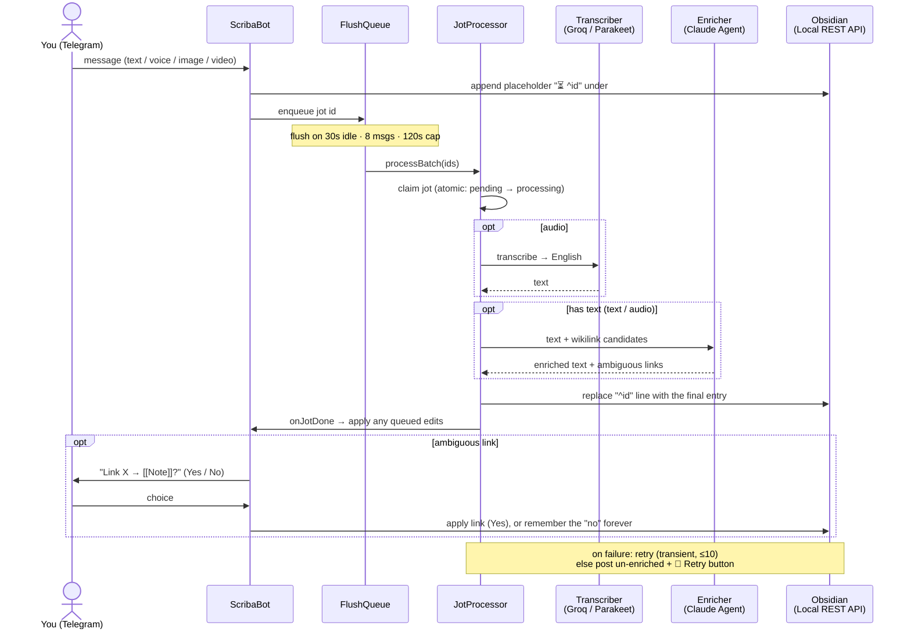
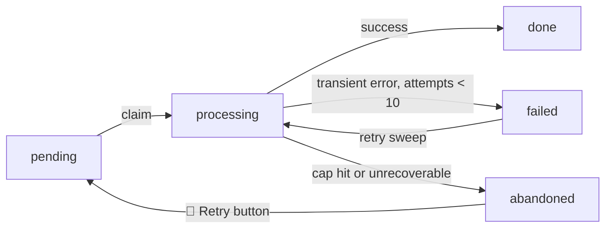

# scriba

Telegram → Obsidian journaling. Send text or a voice note; scriba writes an enriched
entry into your daily note. Images and videos are saved and embedded.

- Placeholder written on arrival, filled in place — ordering never reshuffles.
- Non-English text/voice translated to English (agent for text, Groq for voice).
- Contextual `[[wikilinks]]`; ambiguous ones confirmed via buttons, a "no" is remembered.
- Reply to a jot to edit it (`s/old/new/`, `replace X with Y`, freeform, or `delete`);
  edits sent while a jot is still processing are queued and applied after.
- Failed jots retry (capped at 10; unrecoverable errors post the jot un-enriched and ping you).
- Nightly summary; silent on empty days.

## Flow

A jot is written to the note **twice**: an instant placeholder that fixes its order, then
the enriched version in place. Enrichment happens asynchronously after a batch flush.



Jot status machine:



## Stack

Node 24, TypeScript run via **tsx** (`node --import tsx`, no build step). grammy ·
better-sqlite3 + knex · groq-sdk · `@anthropic-ai/claude-agent-sdk`. One class per block,
wired in `src/index.ts`; all SQL lives in `Repository` (`db.ts`); pure logic in `core.ts`
(tested in `core.test.ts`).

## Auth

- `CLAUDE_CODE_OAUTH_TOKEN` — Claude subscription, no API key (`claude setup-token`).
- `OBSIDIAN_API_KEY` — Obsidian Local REST API.
- Transcription: `TRANSCRIBER=local` (Parakeet sidecar, `PARAKEET_URL` — default) or
  `remote` (Groq, `GROQ_API_KEY`). Text enrichment always uses Claude.

## Develop

```sh
npm install            # needs Node 24 (better-sqlite3 native addon)
cp .env.example .env    # fill in
npm run migrate         # apply schema
npm test                # core logic
npm run dev             # watch
```

## Deploy

`docker compose up -d` starts scriba plus the local Parakeet transcription sidecar
(the default). For remote transcription via Groq instead, set `TRANSCRIBER=remote` and
run just `docker compose up -d scriba`.

Provide the `.env.example` vars, a volume for `DB_PATH`, and (optional) a read-only vault
mount at `/vault` (host source `SCRIBA_VAULT_HOST_PATH`) for the link index. Migrations run at boot. The bot uses long
polling, so no public URL or webhook is needed — the exposed port is only for the health check.

## License

Elastic License 2.0 — see [LICENSE](./LICENSE).
