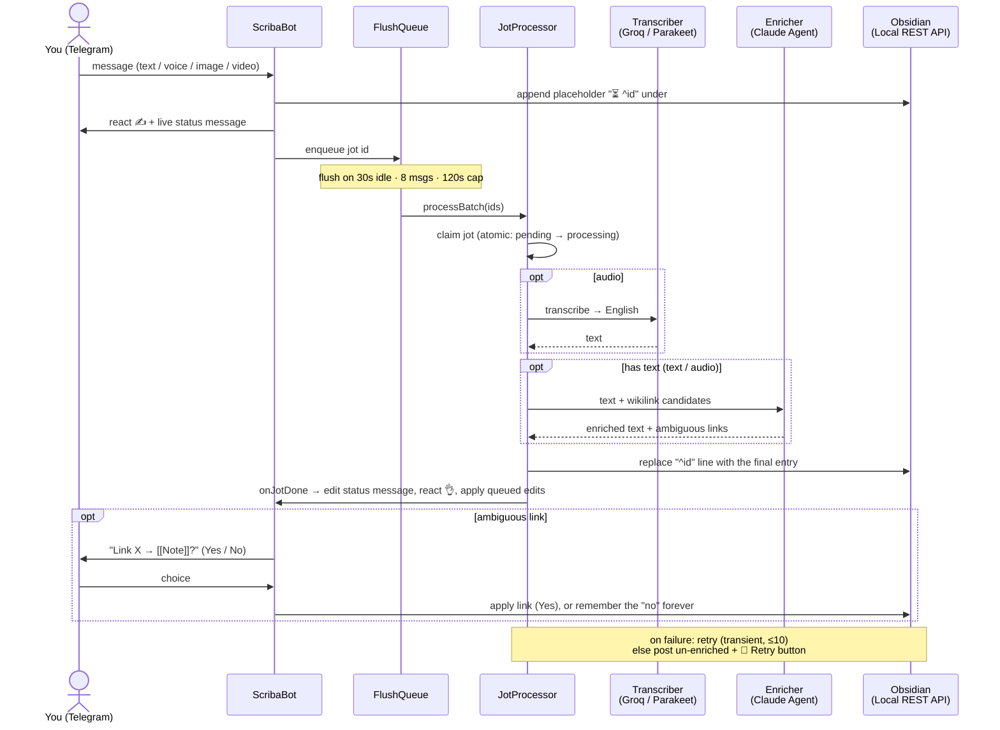
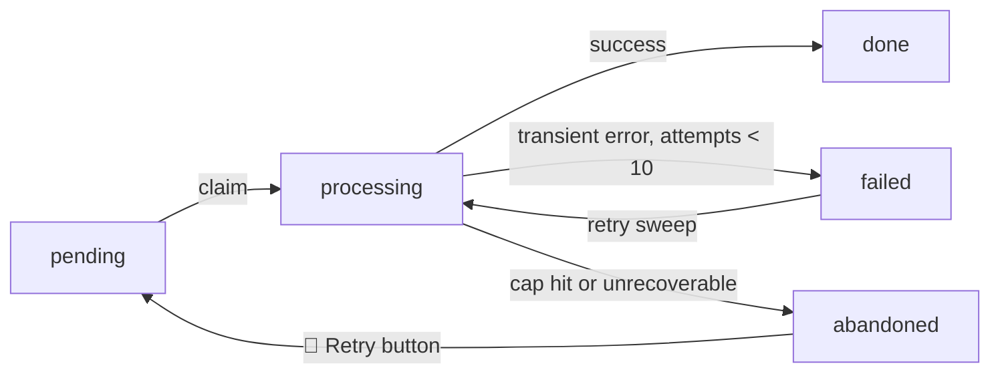

# scriba

Journal to Obsidian from Telegram. You send a text or a voice note and scriba writes it into
today's daily note, just because I am too lazy

> **This is a personal bot.** I built it for myself, so it makes a lot of assumptions about how my vault and machines are set up, and it probably won't work for you out of the box. It's public because the code might be useful. Read the assumptions before you try to run it.

## Assumptions

- **One user.** It only answers one Telegram user id, and it only writes to one Obsidian vault.
- **You run Obsidian with the Local REST API plugin**, reachable from wherever scriba runs.
- **Your vault looks like mine.** Daily notes under `notes/daily notes`, a `## Journal` heading to write under, a `## Habits` checklist, a daily-note template and an assets folder. You can change all of it (check [Environment](#environment)), but the defaults match my vault.
- **Tasks live in two notes.** One for work and one for personal, each with its tasks as a checklist under a single heading, tagged, with `[start:: yyyy-mm-dd]` (optional) and `[due:: yyyy-mm-dd]` (the deadline). That's the shape the Obsidian Tasks plugin queries, and you can configure the paths, headings and tags.
- **The vault is in English.** If you send something in another language, it gets translated on the way in.
- **You have a Claude subscription** (an OAuth token, not an API key). Enrichment runs on haiku and falls back to sonnet, then to a free Groq model, then to OpenCode Go if you set `OPENCODE_GO_API_KEY`.
- **It runs as one always-on process.** Long polling, because it's simpler
- **It's deployed on Coolify.** The GH Actions here trigger the deploy because Coolify caches Docker image tags in a weird way. If you don't want that, just disable the actions

## Features

- When you send a message, scriba writes a placeholder right away and fills it in place once it's processed.
- Your voice notes go to Groq first, and to the local Parakeet sidecar if Groq fails or you don't have a key.
- It adds contextual `[[wikilinks]]`, and you confirm the ambiguous ones with a button.
- You can edit a jot by replying to it with `s/old/new/`, `replace X with Y` or a freeform instruction. Replying with `/delete` removes it.
- **Embeds.** If you send a YouTube, tweet or image link, the entry keeps it as a normal link and the status message gets a 🖼 Embed button. Tap it and scriba rewrites the link as ``, so Obsidian shows it right in your note. You can go back with 🔗 Plain link. Any other link stays a link, Obsidian needs an iframe for those.
- A failed jot is retried up to 10 times, and every failure message has a 🔄 Retry and a 🗑 Delete button. If scriba gives up, the jot goes into the note un-enriched.
- **Task mode.** `/task` turns every message into a task, like "review the RFC by next friday" or "buy cat sand next week". Each one is split into a description, a start date and a deadline, and the type (work or personal) comes from what you said. Nothing is written until you confirm the card, and you can change any of it with its buttons. `/done` closes the mode.
- **One-message tasks.** `/taskadd finish the slides by thursday` reads the line with the model, so messy phrasing in any language works, and shows you the same card to confirm. If you send just `/taskadd`, it asks you for the line.
- **Task lists.** `/tasks` shows what's open, overdue, due today, due this week or in the next fortnight, and what's done. Every row is a button: you tap an open task to tick it off in the vault, and a done one to reopen it.
- **A task summary every morning.** At `TASKS_TIME` (09:00 by default) scriba sends what's due today plus anything still overdue, with the same tickable rows. This one always notifies you, and on a day with nothing due it doesn't send anything.
- **It spots tasks in your journal.** If a jot says you need to do something, scriba offers to make it a task on the same card, and asks when it's due, since a journal entry is often vague about that. You can switch this off from the task menu.
- **Habits and day ratings.** If you have a habit checklist in your daily note, scriba can review it with you one habit at a time. It can also ask you to rate your day every night.

## Setup

You need Node 24, an always-on host with Docker, Obsidian running the Local REST API plugin,
a Telegram bot, and a Claude subscription.

1. **Make a Telegram bot.** Talk to [@BotFather](https://t.me/BotFather), create one and copy the token.
2. **Find your Telegram user id.** Message [@userinfobot](https://t.me/userinfobot) or another raw message bot to get the id you want to allow.
3. **Get a Claude token.** Run `claude setup-token` and copy the result.
4. **Turn on the Obsidian Local REST API** plugin and copy its key. Take note of the URL it serves on (by default `https://127.0.0.1:27124`).
5. **Configure.** Run `cp .env.example .env` and fill it in. You need at least the four required variables, check [Environment](#environment) for the rest.
6. **Run it.** `docker compose up -d` starts scriba and the transcription sidecar.
7. **Say hi.** Message your bot and it should write to today's note. If nothing shows up, check `docker compose logs -f scriba`.

If you set `GROQ_API_KEY`, your voice notes are transcribed with Groq first. Without it, every voice note goes to the sidecar.

## Commands

Every command shows up in the bot's menu. You can type `/menu` for the interactive version, or `/help` to get them as a list.

## Jot lifecycle

A jot (a single journal entry) is written to the note **twice**. First as an instant placeholder, which fixes its order, and then as the enriched version in the same place. We only enrich after a batch flush, so the LLM calls are grouped, because they're expensive.

> Enrichment transcribes the audio if it's a voice note, attaches the image or video, links the text to your other notes with `[[wikilinks]]` and asks you about the ambiguous links. If it fails, scriba retries a few times, and when it gives up the jot goes in un-enriched with a retry button.


```mermaid
sequenceDiagram
    actor U as You (Telegram)
    participant B as ScribaBot
    participant Q as FlushQueue
    participant P as JotProcessor
    participant T as Transcriber<br/>(Groq / Parakeet)
    participant E as Enricher<br/>(Claude Agent)
    participant O as Obsidian<br/>(Local REST API)

    U->>B: message (text / voice / image / video)
    B->>O: append placeholder "⏳ ^id" under ## Journal
    B->>U: react ✍ + live status message
    B->>Q: enqueue jot id
    Note over Q: flush on 30s idle · 8 msgs · 120s cap

    Q->>P: processBatch(ids)
    P->>P: claim jot (atomic: pending → processing)
    opt audio
        P->>T: transcribe → English
        T-->>P: text
    end
    opt has text (text / audio)
        P->>E: text + wikilink candidates
        E-->>P: enriched text + ambiguous links
    end
    P->>O: replace "^id" line with the final entry
    P->>B: onJotDone → edit status message, react 👌, apply queued edits

    opt ambiguous link
        B->>U: "Link X → [[Note]]?" (Yes / No)
        U->>B: choice
        B->>O: apply link (Yes), or remember the "no" forever
    end

    Note over P,O: on failure: retry (transient, ≤10)<br/>else post un-enriched + 🔄 Retry button
```

Each jot goes through these states:


```mermaid
flowchart LR
    pending -->|claim| processing
    processing -->|success| done
    processing -->|transient error, attempts &lt; 10| failed
    failed -->|retry sweep| processing
    processing -->|cap hit or unrecoverable| abandoned
    abandoned -->|🔄 Retry button| pending
```

## Environment

Every variable is in [`.env.example`](./.env.example), with a comment explaining it. Four are required (`TELEGRAM_BOT_TOKEN`, `ALLOWED_TELEGRAM_USER_ID`, `CLAUDE_CODE_OAUTH_TOKEN`, `OBSIDIAN_API_KEY`), and the rest have working defaults.

## Develop

You can run it without Docker:

```sh
npm install     # Node 24, builds the better-sqlite3 addon
cp .env.example .env
npm run migrate # apply schema
npm run dev     # watch mode
npm test        # core logic
```

## License

Elastic License 2.0. Check [LICENSE](./LICENSE).
